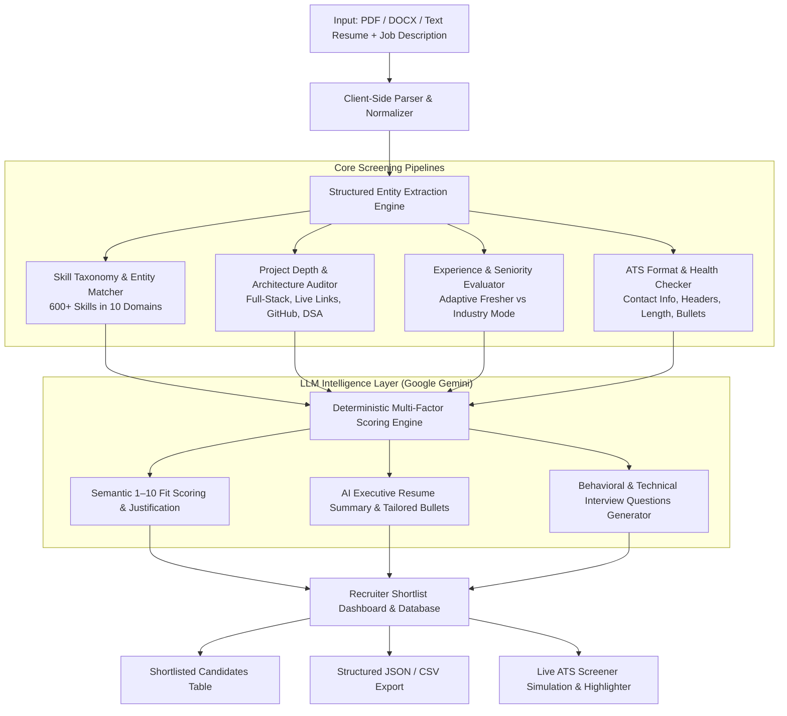

# 🎯 Smart Resume Screener & ATS Candidate Intelligence Platform

> **Automated Candidate Screening, Structured Entity Extraction & LLM Semantic Match Engine**  
> Intelligently parse resumes (PDF/DOCX/Text), extract structured profiles (skills, education, experience, projects), and compute semantic 1–10 match fit ratings with recruiter justifications.

---

## 🏗️ System Architecture



---

## 📊 Scope of Work & Features

### 1. Multi-Format Resume Parsing & Ingestion
- In-browser PDF text extraction via `pdfjs-dist` with page and word count analytics.
- DOCX parsing via `mammoth` and raw plain-text input.

### 2. Structured Data Extraction
Automatically extracts structured JSON entities:
- **Candidate Profile**: Full name, email, phone number, LinkedIn URL, GitHub repo, location.
- **Education & Academics**: Degree (B.Tech, M.S., B.S., etc.), institution, graduation batch year, CGPA/GPA.
- **Experience & Seniority**: Years of professional experience, seniority tier (Fresher vs Experienced).
- **Skills Matrix**: Categorized across Programming Languages, Frontend, Backend, Databases, Cloud/DevOps, AI/ML, and Core CS.
- **Project Depth**: Project count, technologies used, live deployment URLs (Vercel/Netlify), and GitHub links.

### 3. LLM Semantic Matching & 1–10 Fit Scoring
- Computes candidate-to-job semantic fit on a **1 to 10 scale** with decimal precision.
- Generates **Executive Recruiter Justifications** explaining candidate suitability, primary strengths, and missing critical gaps.
- Ranks candidates in the **Candidate Shortlist Database** (persisted in local storage).

### 4. Adaptive Screening Strategies
- **Student / Fresher Mode**: Re-weights the evaluation toward **Project Depth & Technical Execution (25%)** and **Core CS Fundamentals (15%)** instead of penalizing for lack of 5+ years of experience.
- **Industry Professional Mode**: Evaluates enterprise scale, leadership, and production experience.

---

## 🧠 LLM Prompts & Prompt Engineering

### Prompt 1: Candidate Screening & 1–10 Fit Justification
```text
You are a Principal Talent Acquisition Screener and Technical Hiring Manager.
Compare the following candidate resume with this job description.
Rate the candidate's fit on a strict 1 to 10 scale (with decimal precision, e.g. 8.5/10) and provide an executive recruiter screening justification.

Resume:
{{resumeText}}

Job Description:
{{jdText}}

Respond ONLY with valid JSON in this exact structure:
{
  "fitScore10": 8.5,
  "shortlistStatus": "Shortlisted",
  "recruiterJustification": "Candidate demonstrates strong full-stack proficiency with hands-on React and Node.js projects, aligning with 85% of the core JD requirements. Key strength lies in microservices architecture, with minor gaps in Kubernetes experience.",
  "keyStrengths": [
    "Strong frontend & backend alignment",
    "Demonstrated project scale with metrics",
    "Clean Git & CI/CD workflow"
  ],
  "criticalGaps": [
    "Lacks direct Kubernetes production deployment",
    "Limited cloud monitoring mentions"
  ],
  "interviewQuestions": [
    "Can you explain your approach to managing state in complex React applications?",
    "How have you optimized database query performance in your Node.js backend services?"
  ]
}

Shortlist criteria for shortlistStatus:
- "Shortlisted" if fitScore10 >= 7.5
- "Hold / Review" if fitScore10 >= 6.0 and < 7.5
- "Screened Out" if fitScore10 < 6.0
```

### Prompt 2: Tailored Executive Summary & Action Bullets
```text
You are an executive ATS Resume Strategist and Career Coach.
Analyze this Resume against the provided Job Description (JD).
Generate:
1. A compelling 3-4 sentence professional summary tailored specifically to the JD.
2. 3 optimized resume bullet points that incorporate missing JD keywords and quantifiable metrics.
3. 3 likely behavioral or technical interview questions based on the candidate's gaps.
4. A punchy opening paragraph for a tailored cover letter.

Resume:
{{resumeText}}

Job Description:
{{jdText}}

Respond ONLY with valid JSON.
```

---

## 📈 Recruiter Decision Matrix

| Fit Score (1–10) | Match % | Shortlist Decision | Action |
| :--- | :--- | :--- | :--- |
| **7.5 – 10.0** | ≥ 78% | 🟢 **Shortlisted** | Advance immediately to technical interview |
| **6.0 – 7.4** | 62% – 77% | 🟡 **Hold / Review** | Review missing project links or secondary skills |
| **1.0 – 5.9** | < 62% | 🔴 **Screened Out** | Candidate lacks core required competencies |

---

## 🛠️ Tech Stack

- **Frontend & UI**: React 19, JavaScript (ES6+ / JSX), Vite
- **Styling**: Vanilla CSS (Theme tokens, glassmorphism, responsive grid, light/dark mode)
- **Parsing**: PDF.js (`pdfjs-dist`), Mammoth.js (`mammoth`)
- **LLM Integration**: Google Gemini API (`gemini-1.5-flash`)
- **Visuals & Effects**: Lucide React Icons, Canvas Confetti
- **Storage**: Client-side localStorage persistence for candidate database

---

## 🚀 Quick Start & Installation

### 1. Clone the repository
```bash
git clone https://github.com/siva8480/Smart-Resume-Scanner.git
cd Smart-Resume-Scanner
```

### 2. Install dependencies
```bash
npm install
```

### 3. (Optional) Configure Gemini API Key
Create a `.env` file in the root folder:
```env
VITE_GEMINI_API_KEY=your_gemini_api_key_here
```

### 4. Start local development server
```bash
npm run dev
```
Open **[http://localhost:5173](http://localhost:5173)** in your browser.

### 5. Build for Production
```bash
npm run build
```

---

## 📝 License
MIT License © 2026 Smart Resume Screener
